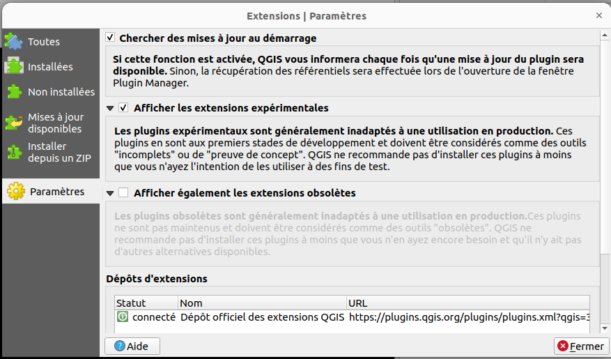
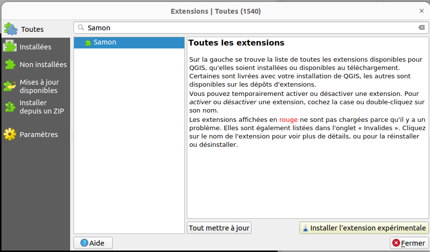

# Samon

Plugin Qgis pour la saisie monoscopique. L'objectif est de calculer les coordonnées 3D du point cliqué sur la BD Ortho en corrigeant notamment le dévers. 

# Installation

* Aller dans Extensions/Installer gérer les extensions/Paramètres
* Cocher "Afficher les extensions expérimentales"

* Aller dans l'onglet "Toutes" et rechercher Samon
* Cliquer sur "Installer l'extension expérimentale"

Dans le cas où il y a des problèmes de librairies qui ne sont pas installées :
## Windows
* Ouvrir OSGeo4W Shell (dans le menu démarrer de Windows) avec les droits administrateurs
* python -m pip install [librairie]
* Par exemple, dans le cas où sklearn n'est pas installé, entrer dans le terminal :
python -m pip install scikit-learn 

## Linux
* QGIS/Extension/Console Python
* import pip
* pip.main(["install", "librairie"])

## Utilisation

Préparer un chantier se fait en deux étapes. La première étape permet de sélectionner les photos à utiliser. la deuxième récupère toutes les données nécessaires pour traiter le chantier. Ensuite, on peut faire la saisie monoscopique

### Etape 1 : Préparation chantier 1

* Importer en local le fichier ta dans le répertoire de travail. Il se trouve généralement dans store-ref/ortho-images/ImagesOrientees/FD[departement]/annee/[...]_AERO/AERO/[...]/*_adjust.XML
* Indiquer le chemin du TA dans le champ Fichier TA.
* Appuyer sur "Démarrer préparation chantier 1"

Samon va enregistrer sous format shapefile les emprises au sol des images orientées puis les afficher.

L'opérateur doit ensuite sélectionner les emprises dont il a besoin puis les sauvegarder dans un nouveau fichier shapefile (à l'aide de Exporter/Sauvegarder les entitées sélectionnées sous...)

### Etape 2 : Préparation chantier 2

Relancer le plugin Samon

Il faut à présent renseigner le formulaire du milieu :
* Fichier TA : indiquer le chemin du TA
* Images séelctionnées : indiquer le chemin du fichier shapefile créé à l'étape précédente
* Images orientées : indiquer le répertoire du store-ref contenant les images orientées
* Store-ref : indiquer le chemin du store-ref
* Appuyer sur "Démarrer préparation chantier 2"

Samon va alors copier en local les images orientées et récupérer la BD ortho et le MNT de la zone. Ces étapes sont un peu longues (surtout si le chantier est grand). Vous suivre l'avancement, ouvrir la fenêtre Vue/Panneaux/Journal des messages/Infos Samon

### Etape 3 : Saisie monoscopique

Relancer le plugin Samon

Il faut remplir le formulaire de droite :
* Répertoire chantier : indiquer le chemin vers le répertoire du chantier (qui contient ortho, mnt, metadata...)
* Méthode de corrélation : par défaut "pva"
* Appuyer sur "Démarrer saisie monoscopique"

Samon va ouvrir la BD Ortho et créer les fichiers qui enregistreront les points. L'opérateur peut ensuite saisir les points sur la BD Ortho.

## Saisie

Touche h : fenêtre qui rappelle les raccourcis clavier
* p : saisir des points
* l : saisir des lignes (un clic droit permet de fermer la forme et d'en créer une nouvelle)
* g : saisir des polygones (un clic droit permet de fermer la forme et d'en créer une nouvelle)
* z : supprimer le dernier point
* s : possibilité de saisir un point sur une des orthos locales du point dernièrement saisi qui sera alors remplacé
* d : possibilité de choisir les pvas utilisées pour le calcul. Dès que l'état d'une checkbox est modifié, le calcul est relancé

A chaque clic, deux points sont créés : le premier est le point cliqué par l'opérateur. Le deuxième est la projection plani du point cliqué (avec correction du dévers). Deux valeurs sont affichées : l'altitude et la différence d'altitude avec le MNT.